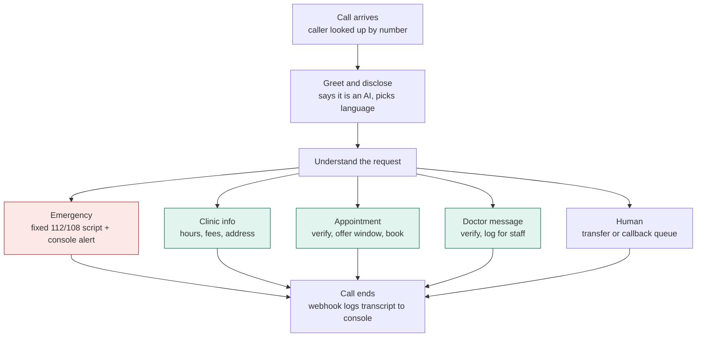

# Inbound call flow

```mermaid
flowchart TB
    start["Call arrives<br/>caller looked up by number"] --> greet["Greet and disclose<br/>says it is an AI, picks language"]
    greet --> intent["Understand the request"]
    intent --> emerg["Emergency<br/>fixed 112/108 script + console alert"]
    intent --> info["Clinic info<br/>hours, fees, address"]
    intent --> appt["Appointment<br/>verify, offer window, book"]
    intent --> msg["Doctor message<br/>verify, log for staff"]
    intent --> human["Human<br/>transfer or callback queue"]
    emerg --> end_["Call ends<br/>webhook logs transcript to console"]
    info --> end_
    appt --> end_
    msg --> end_
    human --> end_

    classDef safety fill:#fde8e8,stroke:#a32d2d;
    classDef agent fill:#e1f5ee,stroke:#0f6e56;
    class emerg safety;
    class info,appt,msg agent;
```

Emergency detection is checked on every turn, not only at intent classification.
Languages: English, Hindi, Hinglish.
